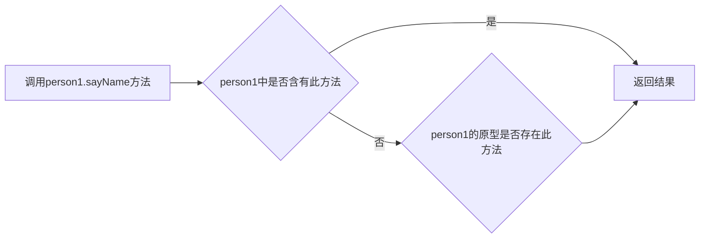

### 对象的定义

```
无序属性的集合，其属性可包含基本值、对象或者函数。----ECMA-262（ECMAscript标准）
```

### 创建简单对象

```js
let person = new Object()
person.name = "Nicholas"
```

或

```js
let person = {
	name: "Nicholas",
  age: 29,
  sayName(){
    console.log(this.name)
  },
  birthday: new Date(2000,0,0)
}
```

### 对象的属性

##### 数据属性

* configurable：bool值。表示能否通过 delete 删除属性从而重新定义属性，能否修改属性的特性，或者能否把属性修改为访问器属性。
* enumerable：bool值。表示能否通过for-in循环属性。
* writable：bool值。表示能否修改属性。
* value：此对象的值。

##### 访问器属性

* get()：读取器
* set(newValue)：写入器

#### Object.defineProperty

数据属性

```js
let person = {}
Object.defineProperty(person, "name", {
  writable: false,
  configurable: false,//一旦此属性定义为false，就不能将其变为可配置了
  value: "Nicholas",
})
console.log(person.name) //"Nicholas"
person.name = "lanluyu"
console.log(person.name)//"Nicholas"
delete person.name
console.log(person.name)//"Nicholas"
//报错。一旦configurable定义为false，就不能将其变为可配置了，反之，则可以多次调用Object.defineProperty
Object.defineProperty(person, "name", {
  writable: false,
  configurable: true,
  value: "Nicholas"
})
```

访问器属性

```js
//使用访问器属性的常见方式，即设置一个属性的值会导致其他属性发生变化。
let math = {num:0,power:0}
Object.defineProperty(math, "num", {
  get: function(){
  	this.num
  },
  set: function(newValue){
    this.power = newValue*newValue
    this.num = newValue
  }
})
```

### 创建对象

1. #### 工厂模式

工厂模式抽象了创建具体对象的过程

```js
function createPersonFactory(name, age, job){
  let o = new Object()
  o.name = name
  o.age = age
  o.job = job
  o.sayName = function(){
    console.log(this.name)
  }
  return o
}

var person1 = createPersonFactory("Nicholas", 29, "Software Engineer");
var person2 = createPersonFactory("lanluyu",27, "briker")
```

2. #### 构造函数模式

```js
function Person(name, age, job){
  this.name = name
  this.age = age
  this.job = job
  this.sayName = function(){
    console.log(this.name)
  }
}
let person3 = new Person("Nicholas", 29, "Software Engineer");
let person4 = new Person("lanluyu",27, "briker")
```

3. #### 原型模式

```js
function Person(){}
Person.prototype.name = "Nicholas"
Person.prototype.age = 29
Person.prototype.job = "briker"
Person.prototype.sayName = function(){
  console.log(this.name)
}


let person1 = new Person()
person1.sayName() //"Nicholas"
let person2 = new Person()
console.log(person1.sayName === person2.sayName) //true

// 可通过isPrototypeOf判断对象是否与此原型有关
console.log(Person.prototype.isPrototypeOf(person1))

// 返回原型
console.log(Object.getPrototypeOf(person1).name)
```



#### 如果给person1一个新值，将覆盖原型的值，直接返回值

```js
o.hasOwnProperty(prperty) //返回非原型属性
property in o //返回所有属性（包括原型）
!o.hasOwnProperty(prperty)&& (property in o) //返回原型属性


Object.key(o) // 返回可枚举的实例属性

```

#### 原型对象带来的问题（共享）

```js
function Person(){}
Person.prototype = {
  constructor: Person,
  name: "Nicholas",
  friends: ["lanluyu", "youyuxi"],
  syaName: function(){
    console.log(this.name)
  }
}
let person1 = new Person()
let person2 = new Person()
person1.friends.push("Van")
console.log(person1.friends)//["lanluyu", "youyuxi", "Van"]
console.log(person2.friends)//["lanluyu", "youyuxi", "Van"]
```

#### 组合使用构造函数模式和原型模式

```js
function Person(name,age){
  this.name = name
  this.age = age
  this.friends = ["lanluyu", "youyuxi"]
}

Person.prototype = {
  constructor: Person,
  sayName: function(){
    console.log(this.name)
  }
}
let person1 = new Person("Sam",28)
let person2 = new Person("Jim",27)
person1.friends.push("Van")
console.log(person1.friends)
console.log(person2.friends)
```

#### 动态原型模式（把上面封装一下）

```js
function Person(name, age){
  this.name = name
  this.age = age
  //只会在初次调用构造函数时，才会执行
  if(typeof this.sayName != "function"){
    Person.prototype.sayname = function(){
      console.log(this.name)
    }
  }
}
let person1 = new Person("Sam",28)
person1.sayName()
```

#### 寄生构造函数模式（前面几种都不适用，可以用此）

> 除了使用 new 操作符并把使用的包装函数叫做构造函数之外，这个模式跟工厂模式其实是一模一样的。

```js
function Person(name, age){
  let o = new Object()
  o.name = name
  o.age = age
  o.sayName = function(){
    console.log(this.name)
  }
  return o
}
let friend = new Person("Nicholas", 29)
friend.sayName()
```

> 缺点：不能依赖 instanceof 操作符来确定对象类型。由于存在上述问题，我们建议在可以使用其他模式的情况下，不要使用这种模式。

#### 稳妥构造函数模式

> 特点： 不引用this，不使用this

```js
function Person(name, age){
  let o = new Object()
  //可在此处定义私有变量和函数
  
  o.sayName = function(){
    console.log(name)
  }
  return o
}
```

### 继承

> ECMAScript只支持实现继承，主要依靠原型链；不支持接口继承。

#### 原型链

```js
function SuperType(){
  this.flag = true
  if(typeof this.sayFlag !== 'function'){
    SuperType.prototype.sayFlag = function(){
      console.log(this.flag)
    }
  }
}

function ChildType(){
  this.subFlag = false
  if(typeof this.saySubFlag !== 'function'){
    SuperType.prototype.saySubFlag = function(){
      console.log(this.subFlag)
    }
  }
}

ChildType.prototype = new SuperType()

let instance = new ChildType()
console.log(instance.sayFlag()) //true
```

#### 借用构造函数继承（经典继承）

```js
clear()
function SuperType(){
  this.colors = ["red", "blue"]
}

function SubType(){
  //继承了SuperType
  SuperType.call(this)
}

let instance = new SubType()
instance.colors.push("black")
console.log(instance.colors)//["red", "blue", "black"]

let instance2 = new SubType()
console.log(instance2.colors)//["red", "blue"]
```

